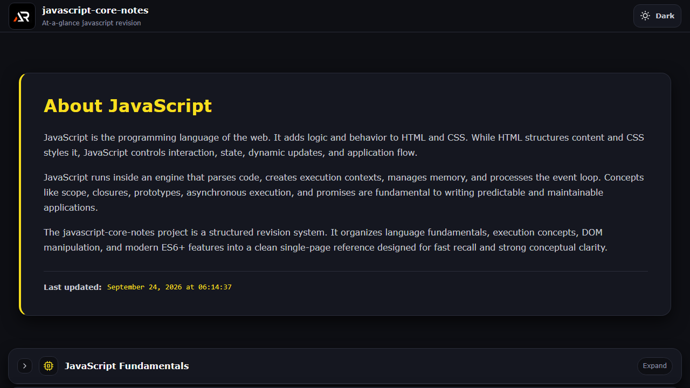

# JavaScript Core Notes

JavaScript Core Notes is a focused single-page revision guide for language fundamentals, execution, browser APIs, asynchronous code, modern syntax, and practical interview patterns.

## Features

- Expandable topic sections for fast revision
- Practical explanations and JavaScript examples
- Dark and light themes with local preference storage
- Internal scroll layout with fixed header and go-to-top control
- Responsive design for desktop and small screens

## Tech stack

React, Vite, styled-components, and React Icons.

## Run locally

```bash
npm install
npm run dev
```

Build and deploy with `npm run build` and `npm run deploy`.

## Screenshot



## Links

- Live: [https://a2rp.github.io/javascript-core-notes/](https://a2rp.github.io/javascript-core-notes/)
- Repository: [https://github.com/a2rp/javascript-core-notes](https://github.com/a2rp/javascript-core-notes)
- Portfolio: [https://www.ashishranjan.net/](https://www.ashishranjan.net/)
- GitHub: [https://github.com/a2rp](https://github.com/a2rp)
- CodePen: [https://codepen.io/ash1198](https://codepen.io/ash1198)
- LinkedIn: [https://www.linkedin.com/in/aashishranjan](https://www.linkedin.com/in/aashishranjan)
- Facebook: [https://www.facebook.com/theash.ashish/](https://www.facebook.com/theash.ashish/)
- YouTube: [https://www.youtube.com/@ashishranjan-ashz?sub_confirmation=1](https://www.youtube.com/@ashishranjan-ashz?sub_confirmation=1)
- Email: [ash.ranjan09@gmail.com](mailto:ash.ranjan09@gmail.com)

## Support

- Support: [https://a2rp-donation-page.netlify.app/](https://a2rp-donation-page.netlify.app/)
- Buy Me a Coffee: [https://buymeacoffee.com/a2rp](https://buymeacoffee.com/a2rp)
- Patreon: [https://www.patreon.com/a2rp](https://www.patreon.com/a2rp)
