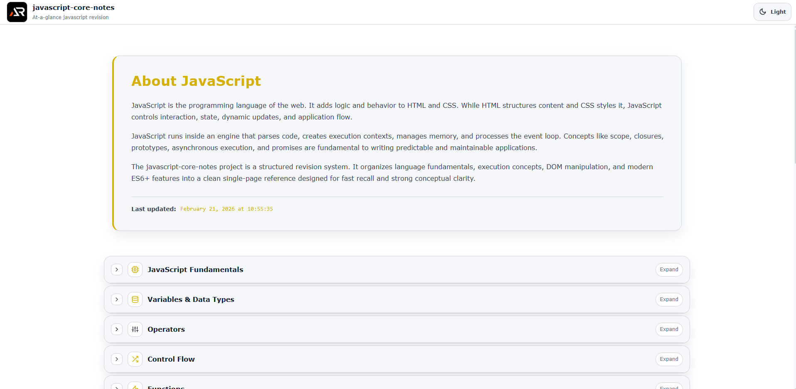

# JavaScript Core Notes

A single-page, at-a-glance revision project for core JavaScript concepts.

This project is designed as a fast reference and structured summary sheet covering essential JavaScript topics without unnecessary depth.  
It focuses on clarity, execution logic, real-world usage, and modern JavaScript fundamentals.

---



---

## Purpose

- Quick revision before interviews
- Rapid recall of core language concepts
- Clear mental model of execution, scope, and async behavior
- Practical, production-focused reminders
- Strong ES6+ foundation without overload

## Coverage

- JavaScript fundamentals and syntax
- Variables, data types, and type coercion
- Operators and control flow
- Functions and scope
- Execution context and hoisting
- Objects and arrays
- String and array methods
- ES6+ essentials
- DOM manipulation
- Events and event propagation
- Asynchronous JavaScript
- Promises and async/await
- Fetch API and API handling
- Error handling
- Closures and advanced function behavior
- this keyword and binding
- Prototypes and class-based OOP
- Modules and imports/exports
- Browser APIs
- Memory model basics
- Event loop and concurrency model
- Functional programming essentials
- Modern JavaScript features
- Common interview traps and best practices

## Tech Stack

- React
- Vite
- styled-components

## Project Type

Single page only  
Section-based navigation  
Searchable and expandable content  
No blog-style content, only structured notes

Each topic is modular and collapsible for fast scanning.

## Run Locally

```bash
npm install
npm run dev
```

---

### Goal

Complete core JavaScript knowledge in one scrollable page.
No fluff. No repetition. Just essentials.

## Links

- Portfolio: [https://www.ashishranjan.net](https://www.ashishranjan.net)
- GitHub: [https://github.com/a2rp](https://github.com/a2rp)
- CodePen: [https://codepen.io/ash1198](https://codepen.io/ash1198)
- LinkedIn: [https://www.linkedin.com/in/aashishranjan](https://www.linkedin.com/in/aashishranjan)
- Facebook: [https://www.facebook.com/theash.ashish/](https://www.facebook.com/theash.ashish/)
- YouTube: [https://www.youtube.com/@ashishranjan-ashz?sub_confirmation=1](https://www.youtube.com/@ashishranjan-ashz?sub_confirmation=1)
- Email: [ash.ranjan09@gmail.com](mailto:ash.ranjan09@gmail.com)

## Support

- Support: [https://a2rp-donation-page.netlify.app/](https://a2rp-donation-page.netlify.app/)
- Buy Me A Coffee: [https://buymeacoffee.com/a2rp](https://buymeacoffee.com/a2rp)
- Patreon: [https://patreon.com/a2rp](https://patreon.com/a2rp)
<!-- Project links -->

## Links

- Live: [https://a2rp.github.io/javascript-core-notes/](https://a2rp.github.io/javascript-core-notes/)
- Repository: [https://github.com/a2rp/javascript-core-notes](https://github.com/a2rp/javascript-core-notes)
- Portfolio: [https://www.ashishranjan.net/](https://www.ashishranjan.net/)
- GitHub: [https://github.com/a2rp](https://github.com/a2rp)
- CodePen: [https://codepen.io/ash1198](https://codepen.io/ash1198)
- LinkedIn: [https://www.linkedin.com/in/aashishranjan](https://www.linkedin.com/in/aashishranjan)
- Facebook: [https://www.facebook.com/theash.ashish/](https://www.facebook.com/theash.ashish/)
- YouTube: [https://www.youtube.com/@ashishranjan-ashz?sub_confirmation=1](https://www.youtube.com/@ashishranjan-ashz?sub_confirmation=1)
- Email: [ash.ranjan09@gmail.com](mailto:ash.ranjan09@gmail.com)

## Support

- Support: [https://a2rp-donation-page.netlify.app/](https://a2rp-donation-page.netlify.app/)
- Buy Me a Coffee: [https://buymeacoffee.com/a2rp](https://buymeacoffee.com/a2rp)
- Patreon: [https://www.patreon.com/a2rp](https://www.patreon.com/a2rp)
